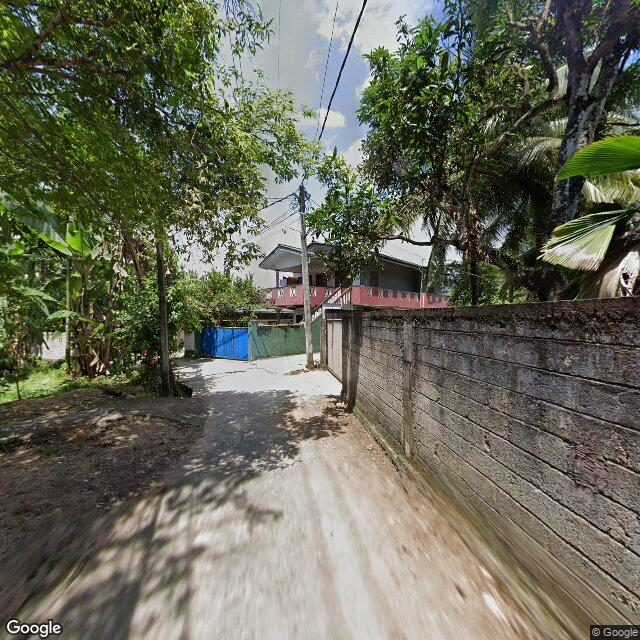
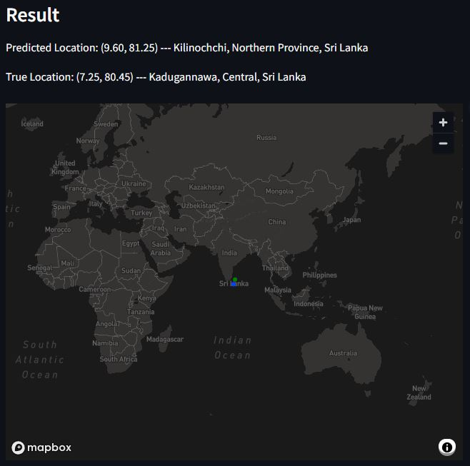

# GeoGuessrAI
[](https://geoguessr-ai.streamlit.app/)

- The model is fine-tuned on the Google street view images labeld with the coordinates.
- The model is able to predict the coordinates of the given street view image.

## 📦 Installation
To install the required packages, run the following command:
```bash
pip install -r requirements.txt
```

## 📚 Dataset
Dataset used for fine-tuning the model is collected from the Google Street View Static API (image) & Faker Library (coordinates).
You can create your own dataset by using the `make_dataset.py` script (you need to get your own API key from the Google Cloud Platform and set it in .env file).
But you have to be careful with the usage of the API because it is not free beyond a certain limit (28,500 requests per month, [pricing](https://mapsplatform.google.com/intl/en/pricing/)).

Training pipeline expects the dataset to be in the following structure:
```bash
root
└── data
    └── coord_images
          ├── lat1,lon1.jpg
          ├── lat2,lon2.jpg
          ├── ...
```


## 🤖 Model & Fine-tuning
The pretrained model is [Tiny CLIP](https://huggingface.co/wkcn/TinyCLIP-ViT-39M-16-Text-19M-YFCC15M)'s Image Encoder which is based on vision transformer model that performs well on various vision tasks with a small number of parameters.  
Regression head is added to the model to predict the coordinates of the given image using the following architecture:
```python
self.location_identifier = nn.Sequential(
    nn.LayerNorm(self.img_encoder.config.projection_dim),
    nn.Linear(self.img_encoder.config.projection_dim, self.img_encoder.config.projection_dim*2),
    nn.GELU(),
    nn.Dropout(0.5),
    nn.Linear(self.img_encoder.config.projection_dim*2, self.img_encoder.config.projection_dim//2),
    nn.GELU(),
    nn.Dropout(0.5),
    nn.Linear(self.img_encoder.config.projection_dim//2, 2)
)
```

The model is fine-tuned on the dataset using the following hyperparameters:
```yaml
train:
  epochs: 50
  patience: 10
  optimizer: AdamW
  vit_lr: 2.0e-05
  head_lr: 0.001
  weight_decay: 0.1

data:
  dataset_dir: ./data/coord_images
  model_name: wkcn/TinyCLIP-ViT-39M-16-Text-19M-YFCC15M
  batch_size: 128
  augment: True
```

You can download the fine-tuned model [here](https://huggingface.co/yosshstd/GeoGuessrAI).

## ⏳️ Inference

### Input: Street view image

<p align="center">
  
</p>

### Output: Predicted coordinates & location (using reverse geocoding)

<p align="center">
  
</p>

## 📝 Refferences
- [Tiny CLIP](https://openaccess.thecvf.com/content/ICCV2023/html/Wu_TinyCLIP_CLIP_Distillation_via_Affinity_Mimicking_and_Weight_Inheritance_ICCV_2023_paper.html)
- [Google Maps Platform](https://mapsplatform.google.com/)
- [Google Street View Static API](https://developers.google.com/maps/documentation/streetview/overview)
- [Hugging Face](https://huggingface.co/)
- [Streamlit](https://streamlit.io/)